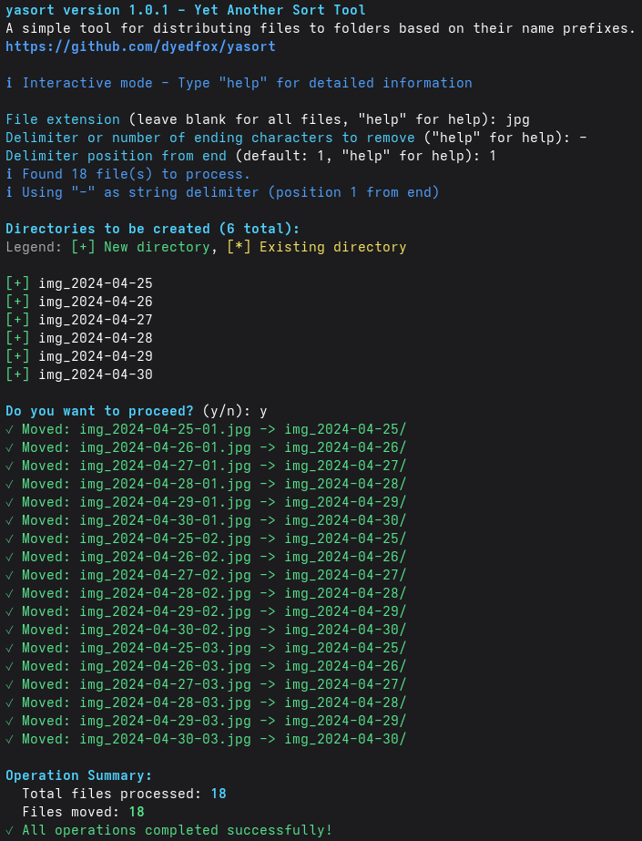

# yasort
A simple way of distributing files to directories based on their name prefixes and file extension.

## Table of Contents
* [General Info](#general-information)
* [Technologies Used](#technologies-used)
* [Features](#features)
* [Usage](#usage)
* [Acknowledgements](#acknowledgements)
* [Contact](#contact)

## General Information
- How it works. For example, a set of files `[gallery1_001.jpg .. gallery1_119.jpg, gallery2_001.jpg .. gallery2_227.jpg]` 
will be distributed into directories `[gallery1, gallery2]` respectively.
- This script simply makes life a little easier :)

## Installation

```bash
curl -sSL https://raw.githubusercontent.com/dyedfox/yasort/main/install.sh | bash
```

## Technologies Used
- Python 3.10 + os module from the Python Standart Library

## Features
- An option to split files by their extensions
- Posibility to choose a delimiter and its position from the end

## Usage

Example 1 of usage:

```bash
yasort
yasort version 1.0.1 - Yet Another Sort Tool
A simple tool for distributing files to folders based on their name prefixes.
https://github.com/dyedfox/yasort

ℹ Interactive mode - Type "help" for detailed information

File extension (leave blank for all files, "help" for help): jpg
Delimiter or number of ending characters to remove ("help" for help): 4
Numeric delimiter detected. Use as: (c)haracter count or (s)tring delimiter? (c/s): c
ℹ Found 600 file(s) to process.
ℹ Using character count mode: removing last 4 characters

Directories to be created (6 total):
Legend: [+] New directory, [*] Existing directory

[+] img_2024-04-25
[+] img_2024-04-26
[+] img_2024-04-27
[+] img_2024-04-28
[+] img_2024-04-29
[+] img_2024-04-30

Do you want to proceed? (y/n): y
✓ Moved: img_2024-04-25-001.jpg -> img_2024-04-25/
✓ Moved: img_2024-04-26-001.jpg -> img_2024-04-26/
✓ Moved: img_2024-04-27-001.jpg -> img_2024-04-27/
✓ Moved: img_2024-04-28-001.jpg -> img_2024-04-28/
✓ Moved: img_2024-04-29-001.jpg -> img_2024-04-29/
✓ Moved: img_2024-04-30-001.jpg -> img_2024-04-30/
✓ Moved: img_2024-04-25-002.jpg -> img_2024-04-25/
✓ Moved: img_2024-04-26-002.jpg -> img_2024-04-26/
✓ Moved: img_2024-04-27-002.jpg -> img_2024-04-27/
✓ Moved: img_2024-04-28-002.jpg -> img_2024-04-28/
✓ Moved: img_2024-04-29-002.jpg -> img_2024-04-29/
✓ Moved: img_2024-04-30-002.jpg -> img_2024-04-30/
✓ Moved: img_2024-04-25-003.jpg -> img_2024-04-25/
✓ Moved: img_2024-04-26-003.jpg -> img_2024-04-26/
✓ Moved: img_2024-04-27-003.jpg -> img_2024-04-27/
✓ Moved: img_2024-04-28-003.jpg -> img_2024-04-28/
✓ Moved: img_2024-04-29-003.jpg -> img_2024-04-29/
✓ Moved: img_2024-04-30-003.jpg -> img_2024-04-30/

Operation Summary:
  Total files processed: 600
  Files moved: 600
✓ All operations completed successfully!
```

Example 2 of usage:

```bash
yasort version 1.0.1 - Yet Another Sort Tool
A simple tool for distributing files to folders based on their name prefixes.
https://github.com/dyedfox/yasort

ℹ Interactive mode - Type "help" for detailed information

File extension (leave blank for all files, "help" for help): jpg
Delimiter or number of ending characters to remove ("help" for help): -
Delimiter position from end (default: 1, "help" for help): 1
ℹ Found 18 file(s) to process.
ℹ Using "-" as string delimiter (position 1 from end)

Directories to be created (6 total):
Legend: [+] New directory, [*] Existing directory

[+] img_2024-04-25
[+] img_2024-04-26
[+] img_2024-04-27
[+] img_2024-04-28
[+] img_2024-04-29
[+] img_2024-04-30

Do you want to proceed? (y/n): y
✓ Moved: img_2024-04-25-01.jpg -> img_2024-04-25/
✓ Moved: img_2024-04-26-01.jpg -> img_2024-04-26/
✓ Moved: img_2024-04-27-01.jpg -> img_2024-04-27/
✓ Moved: img_2024-04-28-01.jpg -> img_2024-04-28/
✓ Moved: img_2024-04-29-01.jpg -> img_2024-04-29/
✓ Moved: img_2024-04-30-01.jpg -> img_2024-04-30/
✓ Moved: img_2024-04-25-02.jpg -> img_2024-04-25/
✓ Moved: img_2024-04-26-02.jpg -> img_2024-04-26/
✓ Moved: img_2024-04-27-02.jpg -> img_2024-04-27/
✓ Moved: img_2024-04-28-02.jpg -> img_2024-04-28/
✓ Moved: img_2024-04-29-02.jpg -> img_2024-04-29/
✓ Moved: img_2024-04-30-02.jpg -> img_2024-04-30/
✓ Moved: img_2024-04-25-03.jpg -> img_2024-04-25/
✓ Moved: img_2024-04-26-03.jpg -> img_2024-04-26/
✓ Moved: img_2024-04-27-03.jpg -> img_2024-04-27/
✓ Moved: img_2024-04-28-03.jpg -> img_2024-04-28/
✓ Moved: img_2024-04-29-03.jpg -> img_2024-04-29/
✓ Moved: img_2024-04-30-03.jpg -> img_2024-04-30/

Operation Summary:
  Total files processed: 18
  Files moved: 18
✓ All operations completed successfully!
```

The output is colorized as follows:



## Acknowledgements
- This project was inspired by GNU/Linux and open-source communities

## Contact
Created by dyedfox - feel free to contact me via GitHub!